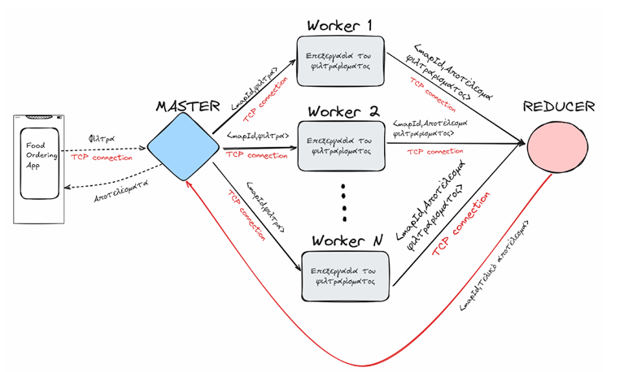

# Delivery App - Distributed Systems
<<<<<<< HEAD
=======
```
git clone https://github.com/All0cator/DistributedSystems.git
```

>>>>>>> b1610b3ce5aa917611039ace45ec41d068aa60e8


## **Installation**

### Backend Architecture

<<<<<<< HEAD

(diagram from project description)
=======

(diagram from project description)
>>>>>>> b1610b3ce5aa917611039ace45ec41d068aa60e8
